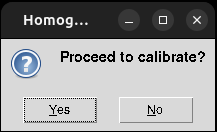
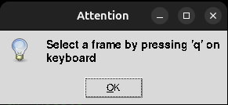
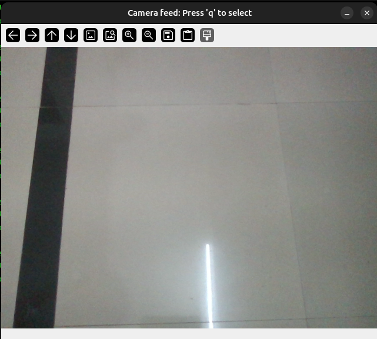
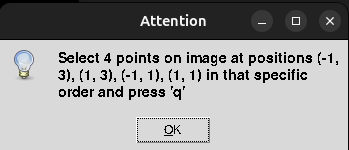
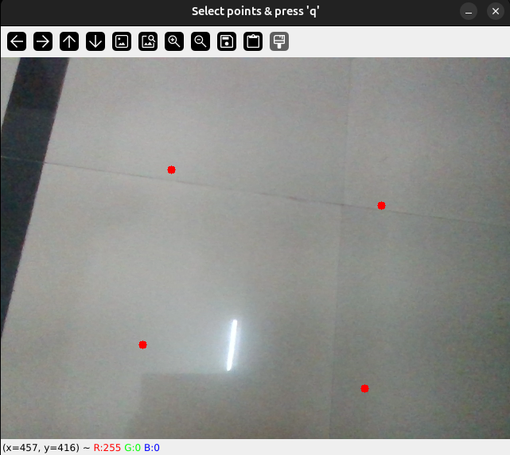

# Visual Positioning
A python app to recognize human beings in a camera feed and estimate their position in terms of real world coordinates
## Requirements
The packages required for the app are listed in requirements.txt. Install them using
```bash
$ pip install -r requirements.txt
```
## How to run
To run the app the homograpy matrix needs to be calibrated.
### Claibrating the homography
The following are the steps to calibrate the homography matrix
1. Delete "homography.csv" & "video_device.txt" from the directory
2. Run the main.py
```bash
$ python main.py
```
3. A dialogue box will ask to proceed for calibration. Click "Yes"

<center></center>

4. A dialogue box will as to press "q" to select a frame

<center></center>

5. Click "OK"
6. A window will open and show the current camera feed

<center></center>

7. When the camera view is appropriate press "q" on keyboard and the corresponding frame will be chosen for calibration
8. Now a messagebox will pop up and instruct to select the points corresponding to (-1,3), (1,3), (-1,1) & (1,1) on ground in the image by clicking on them in that order (the points can be changes in sourcecode).

<center></center>

9. Click "OK"
10. The image frame selected in the previous step will be shown and the points previously stated should be selected in the frame by clicking at them in that order. The clicked points will be higlighted with red dots

<center></center>

10. After selectiing the 4 points press "q" on keyboard
11. The homography will be calibrated and the app will start running
12. Press "q" on keyboard to exit

### Running the app
1. To run the app run main.py
```bash
$ python main.py
```
2. A window will show the live camera feed. Individuals detected will be indicated using a red bounding box along with their real world corrdinates
3. To exit, press "q" on keyboard

